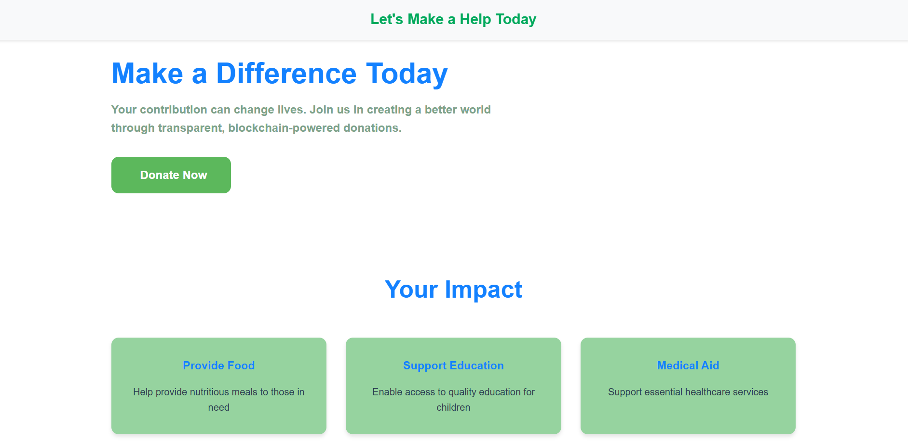
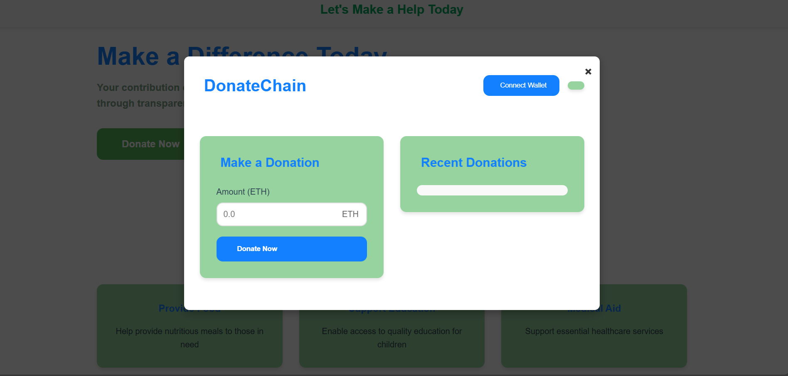

# Decentralized Donation Platform

A blockchain-based donation platform where users can donate funds securely using cryptocurrency.

## Features
- Wallet Connection
- Transparent Donation Tracking
- Admin Dashboard
- Popup Donation Interface

## Installation
1. Clone the repository:  
   `git clone https://github.com/Sudipt111/Decentralised-Donation-Platform.git`

2. Install dependencies:  
   `npm install`

3. Run the app:  
   `npm start`

## Technologies Used
- Solidity
- Web3.js
- HTML, CSS, JavaScript

## Homepage

## donationpage

## Contact
- [Sudipta Kumar Bhoi](https://github.com/Sudipt111)
# Donation DApp
